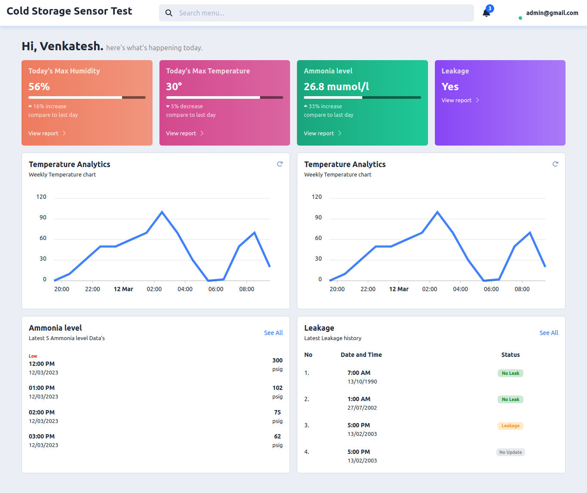

IoT Warehouse Monitoring System
===============================

This project is an IoT-based monitoring system developed for a storage warehouse to monitor various parameters including humidity, temperature, ammonia level, and ammonia leakage. The system utilizes an ESP Wi-Fi module to collect data from sensors and send it to an API. The live reports are displayed on a webpage using PHP, HTML, CSS, and JavaScript, with interactive charts and graphs for enhanced visualization.

Project Collaboration and GitHub Repository
-------------------------------------------

This project is a collaborative effort between the ECE and CSE departments. The GitHub repository for the project can be found at [https://github.com/Venkatesh-KCET/Solar](https://github.com/Venkatesh-KCET/Solar). The repository contains the source code, documentation, and other resources related to the project.

Features
--------

*   **Sensor Monitoring**: The system monitors various parameters including humidity, temperature, ammonia level, and ammonia leakage within the storage warehouse.
*   **ESP Wi-Fi Integration**: An ESP Wi-Fi module is used to collect data from the sensors and establish a connection with the API.
*   **API Communication**: The collected data is sent to an API using the `api.php` file, which allows the use of GET method with parameters such as 'ammonia', 'current', 'humidity', 'leakage', 'pv', 'temperature', and 'voltage'.
*   **Live Report Display**: The collected data is displayed on a webpage in real-time, providing live reports on the monitored parameters.
*   **Interactive Charts and Graphs**: The webpage incorporates charts and graphs to visually represent the data, enhancing interactivity and ease of understanding.
*   **Multiple PV Sensor Support**: The system has the capability to handle multiple PV sensors, allowing for comprehensive monitoring of solar performance.

Usage
-----

To utilize the IoT Warehouse Monitoring System, follow these steps:

1.  Clone or download the project repository from [https://github.com/Venkatesh-KCET/Solar](https://github.com/Venkatesh-KCET/Solar).
2.  Set up the ESP Wi-Fi module and connect the sensors for measuring humidity, temperature, ammonia level, and ammonia leakage.
3.  Modify the `api.php` file to ensure proper handling of the GET method parameters based on your specific sensor configuration.
4.  Upload the necessary files to your web server, including the PHP, HTML, CSS, and JavaScript files.
5.  Access the webpage through a web browser to view the live reports and monitor the warehouse parameters.

Note: Ensure that your web server is properly configured to support PHP and has the required dependencies installed for the project.

Contributors
------------

This project is the result of the collaborative efforts of the ECE and CSE departments. The contributors to the project include:

*   [Venkates S](https://github.com/Venkatesh-KCET) - CSE Department
*   [Venkatesh](https://github.com/venkat0410) - ECE Department
*   [Aakash](https://github.com/aesthet1c0der) - ECE Department
*   [Varun B](https://github.com/) - CSE Department

We appreciate the contributions and dedication of each team member in making this project a success.

License
-------

The project is released under the [MIT License](LICENSE), allowing for modification, distribution, and usage in both personal and commercial projects. However, please note that the project may rely on external libraries or dependencies that may have their own licenses. Make sure to review and comply with the respective licenses of those dependencies when using or distributing this project.
